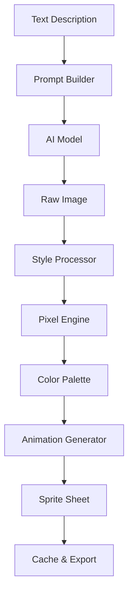

# 🎨 AI Sprite Generator Documentation

## Overview
The AI Sprite Generator is a core system in Tower Madness that creates retro-style pixel art sprites from text descriptions. This system enables dynamic character creation, rapid prototyping, and endless visual variety while maintaining a consistent retro aesthetic.

## Table of Contents
- [System Architecture](#system-architecture)
- [API Reference](#api-reference)
- [Usage Examples](#usage-examples)
- [Sprite Styles](#sprite-styles)
- [Animation System](#animation-system)
- [Batch Processing](#batch-processing)
- [Integration Guide](#integration-guide)
- [Performance Optimization](#performance-optimization)
- [Troubleshooting](#troubleshooting)

## System Architecture

### Core Components

```
sprite_generator/
├── core/
│   ├── generator.py         # Main generation engine
│   ├── style_processor.py   # Style application logic
│   ├── pixel_engine.py      # Pixel art conversion
│   └── color_palette.py     # Retro color management
├── models/
│   ├── ai_model.py          # AI model interface
│   ├── prompt_builder.py    # Description processing
│   └── embeddings.py        # Character embeddings
├── animation/
│   ├── frame_generator.py   # Animation frame creation
│   ├── interpolator.py      # Frame interpolation
│   └── sprite_sheet.py      # Sprite sheet assembly
├── styles/
│   ├── retro_8bit.py        # 8-bit style (NES)
│   ├── retro_16bit.py       # 16-bit style (SNES)
│   ├── cga_mode.py          # CGA 4-color style
│   ├── gameboy.py           # Monochrome Game Boy
│   └── custom.py            # User-defined styles
└── utils/
    ├── cache.py             # Sprite caching system
    ├── validator.py         # Input validation
    └── exporter.py          # Export utilities
```

### Data Flow



## API Reference

### Core Functions

#### `generate_sprite()`
Generates a single sprite from a text description.

```python
def generate_sprite(
    description: str,
    style: str = "16bit",
    size: tuple = (32, 32),
    animation_frames: int = 1,
    emotion: str = None,
    color_palette: str = "default",
    seed: int = None
) -> SpriteObject:
    """
    Generate a retro sprite from text description.
    
    Args:
        description: Natural language character description
        style: Visual style preset ("8bit", "16bit", "cga", "gameboy", "custom")
        size: Sprite dimensions in pixels (width, height)
        animation_frames: Number of animation frames to generate
        emotion: Emotional state ("happy", "angry", "sad", "neutral", "stressed")
        color_palette: Color scheme to use
        seed: Random seed for reproducible generation
    
    Returns:
        SpriteObject containing generated sprite data
    
    Example:
        sprite = generate_sprite(
            "Disheveled tech founder with coffee stains on shirt",
            style="16bit",
            size=(32, 48),
            animation_frames=4,
            emotion="stressed"
        )
    """
```

#### `generate_animation_set()`
Creates a complete animation set for a character.

```python
def generate_animation_set(
    description: str,
    style: str = "16bit",
    size: tuple = (32, 32)
) -> AnimationSet:
    """
    Generate full animation set for a character.
    
    Args:
        description: Character description
        style: Visual style preset
        size: Sprite dimensions
    
    Returns:
        AnimationSet with all standard animations:
        - idle (2-4 frames)
        - walk_left (4-8 frames)
        - walk_right (4-8 frames)
        - walk_up (4-8 frames)
        - walk_down (4-8 frames)
        - action (2-4 frames)
        - special (2-4 frames)
    
    Example:
        animations = generate_animation_set(
            "Robot security guard with glowing eyes",
            style="16bit"
        )
    """
```

#### `batch_generate()`
Generates multiple sprites efficiently.

```python
def batch_generate(
    descriptions: List[str],
    style: str = "16bit",
    size: tuple = (32, 32),
    parallel: bool = True,
    cache: bool = True
) -> List[SpriteObject]:
    """
    Generate multiple sprites in batch.
    
    Args:
        descriptions: List of character descriptions
        style: Visual style for all sprites
        size: Uniform sprite size
        parallel: Use parallel processing
        cache: Cache results for reuse
    
    Returns:
        List of generated SpriteObjects
    
    Example:
        crowd = batch_generate([
            "Anxious startup founder",
            "Confident VC investor",
            "Tired programmer",
            "Enthusiastic intern"
        ])
    """
```

### Style Configuration

#### `create_custom_style()`
Define custom visual styles.

```python
def create_custom_style(
    name: str,
    colors: int,
    palette: List[str],
    resolution: tuple,
    dithering: bool = False,
    outline: bool = True,
    outline_color: str = "#000000"
) -> StylePreset:
    """
    Create a custom sprite style.
    
    Args:
        name: Style identifier
        colors: Maximum color count
        palette: Hex color codes
        resolution: Base resolution
        dithering: Enable dithering
        outline: Add character outline
        outline_color: Outline color
    
    Returns:
        StylePreset object
    
    Example:
        cyberpunk_style = create_custom_style(
            name="cyberpunk",
            colors=16,
            palette=["#00FFFF", "#FF00FF", "#000000", ...],
            resolution=(32, 32),
            dithering=True,
            outline=True,
            outline_color="#00FFFF"
        )
    """
```

## Usage Examples

### Basic Character Generation

```python
# Simple character sprite
janitor = generate_sprite(
    "Friendly janitor with mop and bucket",
    style="16bit",
    size=(32, 48)
)

# Character with emotion
angry_vc = generate_sprite(
    "Venture capitalist in expensive suit checking phone",
    style="16bit",
    emotion="angry",
    size=(32, 48)
)

# Retro 8-bit style
robot = generate_sprite(
    "Clunky robot with antenna and blinking lights",
    style="8bit",
    size=(16, 16)
)
```

### Generating Floor Populations

```python
def generate_floor_population(floor_number: int) -> List[SpriteObject]:
    """Generate appropriate NPCs for a specific floor."""
    
    floor_themes = {
        2: ["Event attendee", "Startup founder pitching", "Tech journalist"],
        5: ["Yoga instructor", "Gym bro", "Personal trainer"],
        6: ["Painter with easel", "Musician with guitar", "Sculptor"],
        7: ["Maker with 3D printer", "Welder with mask", "Electronics hobbyist"],
        8: ["Scientist in lab coat", "Test subject", "Lab assistant"],
        9: ["AI researcher", "Autonomous robot", "Data scientist"],
        10: ["VC partner", "Startup CEO", "Angel investor"],
        11: ["Biohacker", "Longevity researcher", "Nutritionist"],
        12: ["Crypto trader", "Blockchain developer", "DeFi enthusiast"],
        14: ["Philosopher", "Meditation teacher", "Life coach"],
        15: ["Remote worker with laptop", "Student studying", "Librarian"]
    }
    
    descriptions = floor_themes.get(floor_number, ["Generic office worker"])
    return batch_generate(descriptions, style="16bit")
```

### Creating Animated Sprites

```python
# Generate walking animation
walking_programmer = generate_animation_set(
    "Exhausted programmer with energy drink",
    style="16bit",
    size=(32, 48)
)

# Access specific animations
idle_frames = walking_programmer.idle
walk_frames = walking_programmer.walk_left

# Custom animation sequence
panic_animation = generate_sprite(
    "Panicked office worker during fire alarm",
    style="16bit",
    animation_frames=6,
    emotion="panic"
)
```

### Disaster Event Characters

```python
def generate_disaster_sprites(disaster_type: str) -> dict:
    """Generate sprites for disaster scenarios."""
    
    disaster_sprites = {
        "flood": batch_generate([
            "Person wading through water",
            "Maintenance worker with pump",
            "Panicked tenant climbing stairs"
        ]),
        "fire": batch_generate([
            "Firefighter with equipment",
            "Person covering face from smoke",
            "Building manager with extinguisher"
        ]),
        "earthquake": batch_generate([
            "Person bracing in doorway",
            "Injured person needing help",
            "Emergency responder"
        ]),
        "power_outage": batch_generate([
            "Person with phone flashlight",
            "Security guard with flashlight",
            "Confused person in darkness"
        ])
    }
    
    return disaster_sprites.get(disaster_type, [])
```

## Sprite Styles

### 8-Bit Style (NES)
- **Resolution**: 16x16 or 16x32 pixels
- **Colors**: 4 colors per sprite (3 + transparency)
- **Palette**: NES color restrictions
- **Features**: Simple, iconic designs

```python
nes_sprite = generate_sprite(
    description="Italian plumber with mustache",
    style="8bit",
    size=(16, 16),
    color_palette="nes_mario"
)
```

### 16-Bit Style (SNES)
- **Resolution**: 32x32 or 32x48 pixels
- **Colors**: 16 colors per sprite
- **Palette**: Expanded color range
- **Features**: More detail, smooth animations

```python
snes_sprite = generate_sprite(
    description="Knight in shining armor",
    style="16bit",
    size=(32, 48),
    color_palette="medieval"
)
```

### CGA Mode (4-Color)
- **Resolution**: Variable
- **Colors**: 4 colors (typically cyan, magenta, white, black)
- **Palette**: CGA Mode 4 restrictions
- **Features**: High contrast, retro PC aesthetic

```python
cga_sprite = generate_sprite(
    description="Office worker at computer",
    style="cga",
    size=(32, 32),
    color_palette="cga_mode4"
)
```

### Game Boy Style
- **Resolution**: 16x16 or 32x32 pixels
- **Colors**: 4 shades of green
- **Palette**: Original DMG-01 green scale
- **Features**: Monochrome, high readability

```python
gameboy_sprite = generate_sprite(
    description="Cute creature with big eyes",
    style="gameboy",
    size=(16, 16),
    color_palette="dmg_green"
)
```

## Animation System

### Frame Generation

```python
class AnimationFrame:
    """Single frame of sprite animation."""
    
    def __init__(self, image_data: np.array, duration: int = 100):
        self.image = image_data
        self.duration = duration  # milliseconds
        
    def apply_transform(self, transform: str):
        """Apply transformation to frame."""
        transforms = {
            "flip_horizontal": lambda x: np.fliplr(x),
            "flip_vertical": lambda x: np.flipud(x),
            "rotate_90": lambda x: np.rot90(x),
            "brighten": lambda x: np.clip(x * 1.2, 0, 255)
        }
        self.image = transforms[transform](self.image)
```

### Animation Sequences

```python
class AnimationSequence:
    """Manages sprite animation sequences."""
    
    def __init__(self, frames: List[AnimationFrame]):
        self.frames = frames
        self.current_frame = 0
        self.loop = True
        
    def add_frame(self, frame: AnimationFrame):
        """Add frame to sequence."""
        self.frames.append(frame)
        
    def interpolate_frames(self, target_fps: int = 30):
        """Smooth animation by interpolating frames."""
        # Implementation for frame interpolation
        pass
        
    def export_sprite_sheet(self, columns: int = None):
        """Export as sprite sheet."""
        # Arrange frames in grid format
        pass
```

### Emotion-Based Animations

```python
def generate_emotion_variants(base_description: str) -> dict:
    """Generate emotional variants of a character."""
    
    emotions = ["happy", "sad", "angry", "stressed", "neutral", "surprised"]
    variants = {}
    
    for emotion in emotions:
        variants[emotion] = generate_sprite(
            description=base_description,
            style="16bit",
            emotion=emotion,
            animation_frames=2
        )
    
    return variants

# Usage
programmer_emotions = generate_emotion_variants(
    "Young programmer with hoodie and laptop"
)
```

## Batch Processing

### Efficient Crowd Generation

```python
class CrowdGenerator:
    """Generate crowds of sprites efficiently."""
    
    def __init__(self, style: str = "16bit", cache_size: int = 100):
        self.style = style
        self.cache = SpriteCache(max_size=cache_size)
        
    def generate_crowd(
        self,
        size: int,
        theme: str,
        variation: float = 0.3
    ) -> List[SpriteObject]:
        """
        Generate crowd with variations.
        
        Args:
            size: Number of sprites
            theme: Crowd theme (e.g., "office workers", "artists")
            variation: Variation factor (0-1)
        """
        base_descriptions = self._get_theme_descriptions(theme)
        crowd = []
        
        for i in range(size):
            # Add variations to base descriptions
            desc = self._add_variation(
                random.choice(base_descriptions),
                variation
            )
            
            # Check cache first
            sprite = self.cache.get(desc)
            if not sprite:
                sprite = generate_sprite(desc, style=self.style)
                self.cache.add(desc, sprite)
                
            crowd.append(sprite)
            
        return crowd
```

### Parallel Generation

```python
from concurrent.futures import ThreadPoolExecutor
import asyncio

async def generate_sprites_async(descriptions: List[str]) -> List[SpriteObject]:
    """Generate sprites in parallel for better performance."""
    
    async def generate_single(desc: str) -> SpriteObject:
        return await asyncio.to_thread(
            generate_sprite,
            desc,
            style="16bit"
        )
    
    tasks = [generate_single(desc) for desc in descriptions]
    return await asyncio.gather(*tasks)

# Usage
async def populate_building():
    all_descriptions = []
    for floor in range(1, 17):
        all_descriptions.extend(get_floor_descriptions(floor))
    
    sprites = await generate_sprites_async(all_descriptions)
    return sprites
```

## Integration Guide

### Pygame Integration

```python
import pygame
from sprite_generator import generate_sprite

class NPCSprite(pygame.sprite.Sprite):
    """Pygame sprite wrapper for generated sprites."""
    
    def __init__(self, description: str, x: int, y: int):
        super().__init__()
        
        # Generate sprite
        sprite_obj = generate_sprite(
            description,
            style="16bit",
            size=(32, 48),
            animation_frames=4
        )
        
        # Convert to Pygame surface
        self.frames = []
        for frame in sprite_obj.frames:
            surface = pygame.surfarray.make_surface(frame.image)
            self.frames.append(surface)
            
        self.image = self.frames[0]
        self.rect = self.image.get_rect()
        self.rect.x = x
        self.rect.y = y
        
        # Animation state
        self.current_frame = 0
        self.animation_speed = 0.1
        self.animation_timer = 0
        
    def update(self, dt):
        """Update animation."""
        self.animation_timer += dt
        if self.animation_timer >= self.animation_speed:
            self.animation_timer = 0
            self.current_frame = (self.current_frame + 1) % len(self.frames)
            self.image = self.frames[self.current_frame]
```

### Unity Integration

```csharp
using UnityEngine;
using System.Collections;

public class SpriteGeneratorBridge : MonoBehaviour
{
    private string apiEndpoint = "http://localhost:5000/generate";
    
    public IEnumerator GenerateSprite(
        string description,
        System.Action<Sprite> callback
    )
    {
        // Create request
        var request = new UnityWebRequest(apiEndpoint, "POST");
        var data = JsonUtility.ToJson(new {
            description = description,
            style = "16bit",
            size = new int[] {32, 48}
        });
        
        byte[] bodyRaw = System.Text.Encoding.UTF8.GetBytes(data);
        request.uploadHandler = new UploadHandlerRaw(bodyRaw);
        request.downloadHandler = new DownloadHandlerBuffer();
        request.SetRequestHeader("Content-Type", "application/json");
        
        yield return request.SendWebRequest();
        
        if (request.result == UnityWebRequest.Result.Success)
        {
            // Parse response and create sprite
            var texture = new Texture2D(32, 48);
            texture.LoadImage(request.downloadHandler.data);
            
            var sprite = Sprite.Create(
                texture,
                new Rect(0, 0, 32, 48),
                new Vector2(0.5f, 0.5f)
            );
            
            callback(sprite);
        }
    }
}
```

## Performance Optimization

### Caching Strategy

```python
class SpriteCache:
    """LRU cache for generated sprites."""
    
    def __init__(self, max_size: int = 100):
        self.cache = {}
        self.access_order = []
        self.max_size = max_size
        
    def get(self, key: str) -> SpriteObject:
        """Retrieve sprite from cache."""
        if key in self.cache:
            # Update access order
            self.access_order.remove(key)
            self.access_order.append(key)
            return self.cache[key]
        return None
        
    def add(self, key: str, sprite: SpriteObject):
        """Add sprite to cache."""
        if len(self.cache) >= self.max_size:
            # Remove least recently used
            lru_key = self.access_order.pop(0)
            del self.cache[lru_key]
            
        self.cache[key] = sprite
        self.access_order.append(key)
        
    def preload_common_sprites(self):
        """Preload frequently used sprites."""
        common_descriptions = [
            "Generic office worker",
            "Security guard",
            "Janitor with mop",
            "Delivery person with package"
        ]
        
        for desc in common_descriptions:
            if desc not in self.cache:
                sprite = generate_sprite(desc)
                self.add(desc, sprite)
```

### Memory Management

```python
class SpriteMemoryManager:
    """Manage sprite memory usage."""
    
    def __init__(self, max_memory_mb: int = 100):
        self.max_memory = max_memory_mb * 1024 * 1024  # Convert to bytes
        self.current_memory = 0
        self.sprites = {}
        
    def estimate_sprite_size(self, sprite: SpriteObject) -> int:
        """Estimate memory usage of sprite."""
        size = 0
        for frame in sprite.frames:
            size += frame.image.nbytes
        return size
        
    def load_sprite(self, key: str, sprite: SpriteObject) -> bool:
        """Load sprite if memory available."""
        sprite_size = self.estimate_sprite_size(sprite)
        
        if self.current_memory + sprite_size > self.max_memory:
            # Try to free memory
            self.cleanup_unused()
            
        if self.current_memory + sprite_size <= self.max_memory:
            self.sprites[key] = sprite
            self.current_memory += sprite_size
            return True
            
        return False
        
    def cleanup_unused(self):
        """Remove unused sprites from memory."""
        # Implementation for cleanup logic
        pass
```

## Troubleshooting

### Common Issues

#### Issue: Sprites look blurry
**Solution**: Ensure pixel-perfect rendering is enabled in your game engine.

```python
# Pygame example
pygame.display.set_mode((800, 600), pygame.SCALED)
```

#### Issue: Generation is slow
**Solution**: Use batch processing and caching.

```python
# Enable caching
cache = SpriteCache(max_size=200)

# Use batch generation
sprites = batch_generate(descriptions, parallel=True)
```

#### Issue: Inconsistent art style
**Solution**: Use style presets and seed values.

```python
# Consistent generation with seed
sprite1 = generate_sprite("Robot", seed=42)
sprite2 = generate_sprite("Robot", seed=42)  # Same result
```

#### Issue: Memory usage too high
**Solution**: Implement sprite pooling and cleanup.

```python
class SpritePool:
    """Reuse sprite objects to reduce memory."""
    
    def __init__(self, max_sprites: int = 50):
        self.available = []
        self.in_use = []
        self.max_sprites = max_sprites
        
    def get_sprite(self, description: str) -> SpriteObject:
        if self.available:
            sprite = self.available.pop()
            sprite.regenerate(description)
        else:
            sprite = generate_sprite(description)
            
        self.in_use.append(sprite)
        return sprite
        
    def return_sprite(self, sprite: SpriteObject):
        self.in_use.remove(sprite)
        self.available.append(sprite)
```

### Error Codes

| Code | Description | Solution |
|------|-------------|----------|
| SG001 | Invalid description format | Check description string |
| SG002 | Style not found | Use valid style preset |
| SG003 | Size out of bounds | Use size between 8x8 and 128x128 |
| SG004 | Generation timeout | Simplify description or increase timeout |
| SG005 | Cache full | Increase cache size or clear cache |
| SG006 | Memory limit exceeded | Reduce sprite count or quality |
| SG007 | Invalid color palette | Check palette name or format |
| SG008 | Animation frame error | Verify frame count is valid |

## Best Practices

### Description Guidelines

```python
# Good descriptions - specific and visual
good_examples = [
    "Tall security guard with sunglasses and earpiece",
    "Short elderly janitor with grey hair pushing mop bucket",
    "Young programmer with messy hair wearing hoodie and headphones"
]

# Poor descriptions - too vague
poor_examples = [
    "Person",
    "Worker",
    "Someone standing"
]
```

### Style Consistency

```python
class StyleManager:
    """Maintain consistent visual style across game."""
    
    def __init__(self, base_style: str = "16bit"):
        self.base_style = base_style
        self.style_overrides = {}
        
    def register_floor_style(self, floor: int, style: str):
        """Override style for specific floor."""
        self.style_overrides[floor] = style
        
    def get_style_for_floor(self, floor: int) -> str:
        """Get appropriate style for floor."""
        return self.style_overrides.get(floor, self.base_style)
        
    def generate_floor_sprite(self, floor: int, description: str):
        """Generate sprite with floor-appropriate style."""
        style = self.get_style_for_floor(floor)
        return generate_sprite(description, style=style)
```

### Testing Sprites

```python
import unittest

class TestSpriteGeneration(unittest.TestCase):
    """Test sprite generation functionality."""
    
    def test_basic_generation(self):
        """Test basic sprite generation."""
        sprite = generate_sprite("Test character")
        self.assertIsNotNone(sprite)
        self.assertEqual(sprite.size, (32, 32))
        
    def test_style_consistency(self):
        """Test style consistency with seed."""
        sprite1 = generate_sprite("Robot", seed=123)
        sprite2 = generate_sprite("Robot", seed=123)
        self.assertEqual(sprite1.checksum, sprite2.checksum)
        
    def test_batch_performance(self):
        """Test batch generation performance."""
        import time
        descriptions = ["Character " + str(i) for i in range(10)]
        
        start = time.time()
        sprites = batch_generate(descriptions)
        duration = time.time() - start
        
        self.assertLess(duration, 5.0)  # Should complete in 5 seconds
        self.assertEqual(len(sprites), 10)
```

---

## Conclusion

The AI Sprite Generator system provides a powerful, flexible solution for creating retro-style sprites dynamically. By following this documentation and best practices, you can efficiently generate diverse, consistent pixel art for your game while maintaining performance and visual coherence.

For additional support or feature requests, please refer to the project's GitHub repository or contact the development team.