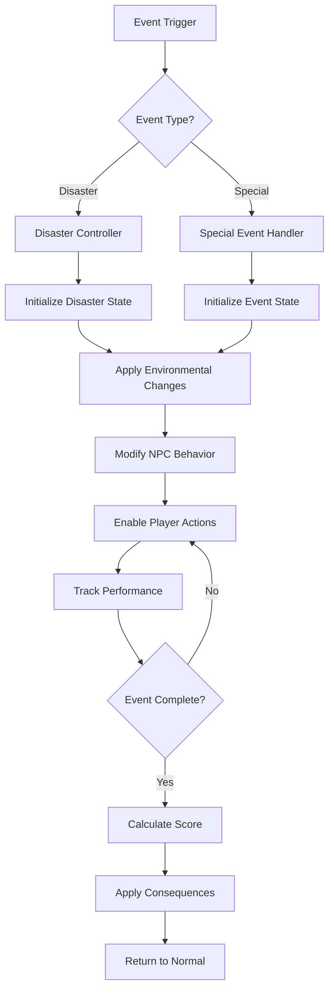

# 💥 Special Events & Disasters System Documentation

## Overview
The Special Events & Disasters System creates dynamic, challenging scenarios that disrupt normal elevator operations. These events range from minor inconveniences to building-wide emergencies, providing variety, challenge, and memorable moments in gameplay.

## Table of Contents
- [System Architecture](#system-architecture)
- [Event Categories](#event-categories)
- [Disaster Types](#disaster-types)
- [Event Triggers](#event-triggers)
- [Response Mechanics](#response-mechanics)
- [Scoring & Consequences](#scoring--consequences)
- [Event Scripting](#event-scripting)
- [Visual & Audio Effects](#visual--audio-effects)
- [Difficulty Scaling](#difficulty-scaling)
- [Implementation Guide](#implementation-guide)

## System Architecture

### Core Components

```
events_disasters/
├── core/
│   ├── event_manager.py       # Main event orchestration
│   ├── disaster_controller.py # Disaster-specific logic
│   ├── event_scheduler.py     # Time-based event scheduling
│   └── trigger_system.py      # Event trigger conditions
├── events/
│   ├── special_events.py      # Non-disaster special events
│   ├── vip_events.py          # VIP and celebrity visits
│   ├── social_events.py       # Parties, meetings, etc.
│   └── random_events.py       # Random occurrences
├── disasters/
│   ├── natural/
│   │   ├── earthquake.py      # Earthquake disaster
│   │   ├── flood.py           # Flooding disaster
│   │   └── storm.py           # Storm/weather events
│   ├── technical/
│   │   ├── power_outage.py    # Power failure
│   │   ├── elevator_failure.py # Mechanical failures
│   │   └── system_crash.py    # Building system failures
│   ├── social/
│   │   ├── overcrowding.py    # Mass crowd events
│   │   ├── evacuation.py      # Emergency evacuations
│   │   └── panic.py           # Panic situations
│   └── special/
│       ├── robot_uprising.py  # Robot rebellion
│       ├── biohazard.py       # Chemical/bio leaks
│       └── crypto_crash.py    # Market crash chaos
├── responses/
│   ├── player_actions.py      # Available player responses
│   ├── npc_reactions.py       # NPC behavior during events
│   └── building_systems.py    # Building response systems
├── effects/
│   ├── visual_effects.py      # Screen effects, particles
│   ├── audio_manager.py       # Sound effects, alarms
│   └── physics_modifiers.py   # Physics changes
└── scoring/
    ├── performance_tracker.py # Track player performance
    ├── consequence_system.py  # Long-term consequences
    └── achievement_checker.py # Special achievements
```

### Event Flow



## Event Categories

### Special Events

```python
class SpecialEvent:
    """Base class for non-disaster special events."""
    
    EVENTS = {
        "vip_visit": {
            "description": "Important person needs elevator priority",
            "duration": 120,
            "frequency": "daily",
            "warning_time": 30,
            "requirements": ["clear_elevator", "priority_service"],
            "rewards": {"reputation": 100, "tips": 500}
        },
        "tech_conference": {
            "description": "Mass influx of conference attendees",
            "duration": 300,
            "frequency": "weekly",
            "warning_time": 60,
            "requirements": ["manage_crowds", "efficient_routing"],
            "rewards": {"experience": 200, "tips": 1000}
        },
        "film_crew": {
            "description": "Film crew needs elevator for shooting",
            "duration": 180,
            "frequency": "rare",
            "warning_time": 15,
            "requirements": ["keep_elevator_still", "quiet_operation"],
            "rewards": {"reputation": 150, "special_item": "movie_poster"}
        },
        "health_inspection": {
            "description": "Inspector checking elevator safety",
            "duration": 90,
            "frequency": "monthly",
            "warning_time": 0,
            "requirements": ["clean_elevator", "proper_operation"],
            "penalties": {"failed": -500, "violations": -100}
        },
        "celebrity_sighting": {
            "description": "Celebrity causes crowd frenzy",
            "duration": 60,
            "frequency": "rare",
            "warning_time": 0,
            "effects": ["crowd_rush", "paparazzi", "security_lockdown"],
            "rewards": {"reputation": 200, "social_media_boost": True}
        }
    }
```

### Scheduled Events

```python
class ScheduledEvents:
    """Time-based recurring events."""
    
    DAILY_EVENTS = {
        "morning_rush": {
            "time": "08:00-09:30",
            "description": "Morning commute rush",
            "passenger_multiplier": 3.0,
            "patience_modifier": 0.5,
            "tip_modifier": 0.8
        },
        "lunch_break": {
            "time": "12:00-13:00",
            "description": "Lunch hour traffic",
            "passenger_multiplier": 2.0,
            "patience_modifier": 0.7,
            "special_requests": ["food_delivery", "quick_trips"]
        },
        "happy_hour": {
            "time": "17:00-19:00",
            "description": "After work socializing",
            "passenger_multiplier": 2.5,
            "drunk_passengers": True,
            "patience_modifier": 1.2
        },
        "late_night": {
            "time": "22:00-02:00",
            "description": "Late night skeleton crew",
            "passenger_multiplier": 0.3,
            "special_npcs": ["security", "janitor", "late_worker"],
            "eerie_atmosphere": True
        }
    }
    
    WEEKLY_EVENTS = {
        "monday_blues": {
            "day": "monday",
            "description": "Everyone hates Mondays",
            "mood_modifier": -0.3,
            "patience_modifier": 0.6
        },
        "friday_excitement": {
            "day": "friday",
            "description": "TGIF energy",
            "mood_modifier": 0.5,
            "tip_modifier": 1.3
        }
    }
```

## Disaster Types

### Natural Disasters

#### Earthquake

```python
class EarthquakeDisaster:
    """Earthquake disaster implementation."""
    
    def __init__(self, magnitude: float):
        self.magnitude = magnitude  # 1.0 to 10.0
        self.duration = self.calculate_duration()
        self.aftershocks = self.generate_aftershocks()
        
    def calculate_effects(self):
        """Calculate earthquake effects based on magnitude."""
        effects = {
            "screen_shake": self.magnitude * 10,
            "elevator_sway": self.magnitude * 5,
            "structural_damage": self.magnitude > 6.0,
            "falling_debris": self.magnitude > 5.0,
            "power_failure_chance": self.magnitude / 10,
            "panic_level": min(self.magnitude * 15, 100),
            "elevator_stop_required": self.magnitude > 4.0
        }
        return effects
        
    def generate_aftershocks(self):
        """Generate aftershock sequence."""
        aftershocks = []
        count = random.randint(1, int(self.magnitude))
        for i in range(count):
            aftershocks.append({
                "delay": random.uniform(10, 120),
                "magnitude": self.magnitude * random.uniform(0.3, 0.7)
            })
        return aftershocks
        
    def update(self, dt: float, elevator: Elevator):
        """Update earthquake effects."""
        if self.is_active():
            # Apply shaking
            elevator.apply_shake(self.magnitude)
            
            # Check for damage
            if random.random() < 0.01 * self.magnitude:
                self.cause_damage(elevator)
                
            # Update passenger panic
            for passenger in elevator.passengers:
                passenger.panic += dt * self.magnitude * 2
```

#### Flood

```python
class FloodDisaster:
    """Flooding disaster implementation."""
    
    def __init__(self, source: str = "basement"):
        self.source = source
        self.water_level = 0.0
        self.rise_rate = 0.5  # meters per minute
        self.flooded_floors = []
        self.electrical_hazard = False
        
    def update(self, dt: float, building: Building):
        """Update flood progression."""
        # Water rises
        self.water_level += self.rise_rate * dt / 60
        
        # Check which floors are flooded
        for floor in building.floors:
            if floor.height <= self.water_level:
                if floor not in self.flooded_floors:
                    self.flood_floor(floor)
                    
        # Electrical hazard chance
        if self.water_level > 1.0 and not self.electrical_hazard:
            if random.random() < 0.3:
                self.electrical_hazard = True
                self.trigger_power_failure()
                
    def flood_floor(self, floor: Floor):
        """Flood a specific floor."""
        self.flooded_floors.append(floor)
        floor.accessible = False
        floor.hazard_level = "extreme"
        
        # Evacuate NPCs
        for npc in floor.npcs:
            npc.state = "evacuating"
            npc.destination = "higher_floor"
            
    def player_actions(self) -> List[str]:
        """Available player actions during flood."""
        return [
            "evacuate_lower_floors",
            "emergency_express_mode",
            "skip_flooded_floors",
            "rescue_trapped_npcs"
        ]
```

### Technical Disasters

#### Power Outage

```python
class PowerOutageDisaster:
    """Power failure disaster."""
    
    def __init__(self, scope: str = "building"):
        self.scope = scope  # "elevator", "floor", "building", "city"
        self.emergency_power = True
        self.battery_remaining = 300  # 5 minutes
        self.emergency_lights = True
        self.affected_systems = self.determine_affected_systems()
        
    def determine_affected_systems(self):
        """Determine which systems are affected."""
        systems = {
            "elevator": ["main_lights", "music", "display"],
            "floor": ["room_lights", "computers", "equipment"],
            "building": ["elevators", "lights", "hvac", "security"],
            "city": ["everything", "cell_towers", "traffic"]
        }
        return systems[self.scope]
        
    def update(self, dt: float):
        """Update power outage state."""
        if self.emergency_power:
            self.battery_remaining -= dt
            
            if self.battery_remaining <= 0:
                self.emergency_power = False
                self.emergency_lights = False
                
        # Flicker effects
        if self.emergency_power and random.random() < 0.01:
            self.flicker_lights()
            
    def elevator_restrictions(self):
        """Get elevator operation restrictions."""
        if not self.emergency_power:
            return {
                "movement_speed": 0,
                "door_operation": False,
                "floor_selection": False
            }
        else:
            return {
                "movement_speed": 0.3,
                "door_operation": True,
                "floor_selection": "limited",  # Every 3rd floor
                "time_limit": self.battery_remaining
            }
```

#### Elevator Malfunction

```python
class ElevatorMalfunction:
    """Mechanical elevator failures."""
    
    MALFUNCTION_TYPES = {
        "cable_stress": {
            "description": "Cable showing signs of wear",
            "warning_signs": ["creaking", "vibration"],
            "progression_rate": 0.1,
            "critical_threshold": 1.0,
            "player_actions": ["slow_movement", "reduce_weight", "call_maintenance"]
        },
        "door_jam": {
            "description": "Doors won't close properly",
            "warning_signs": ["grinding_noise", "slow_operation"],
            "fix_method": "manual_override",
            "passenger_reaction": "impatient"
        },
        "control_failure": {
            "description": "Control panel malfunction",
            "effects": ["random_floors", "stuck_buttons", "display_error"],
            "workaround": "manual_operation"
        },
        "brake_failure": {
            "description": "Emergency brakes not engaging",
            "danger_level": "extreme",
            "effects": ["cannot_stop", "speed_increase"],
            "solution": "emergency_protocol"
        },
        "stuck_between_floors": {
            "description": "Elevator stuck between floors",
            "duration": 180,
            "passenger_panic_rate": 0.5,
            "solutions": ["wait_for_help", "manual_adjustment", "emergency_exit"]
        }
    }
    
    def __init__(self, malfunction_type: str):
        self.type = malfunction_type
        self.properties = self.MALFUNCTION_TYPES[malfunction_type]
        self.progression = 0.0
        self.resolved = False
        
    def update(self, dt: float, player_action: str = None):
        """Update malfunction state."""
        if not self.resolved:
            # Progress malfunction
            self.progression += self.properties.get("progression_rate", 0) * dt
            
            # Check if player action helps
            if player_action in self.properties.get("player_actions", []):
                self.progression -= 0.2
                
            # Check if critical
            if self.progression >= self.properties.get("critical_threshold", 1.0):
                self.trigger_critical_failure()
```

### Social Disasters

#### Overcrowding

```python
class OvercrowdingDisaster:
    """Mass crowd events."""
    
    def __init__(self, crowd_size: int, trigger: str):
        self.crowd_size = crowd_size
        self.trigger = trigger  # "event", "emergency", "celebrity"
        self.crowd_mood = self.determine_mood()
        self.crowd_patience = 100
        self.trampling_risk = False
        
    def determine_mood(self):
        """Determine crowd mood based on trigger."""
        moods = {
            "event": "excited",
            "emergency": "panicked",
            "celebrity": "frenzied",
            "sale": "aggressive",
            "evacuation": "fearful"
        }
        return moods.get(self.trigger, "neutral")
        
    def update(self, dt: float, elevator: Elevator):
        """Update crowd dynamics."""
        # Decrease patience
        self.crowd_patience -= dt * 0.5
        
        # Check for mob behavior
        if self.crowd_patience < 30:
            self.crowd_mood = "angry"
            
        if self.crowd_patience < 10:
            self.trampling_risk = True
            
        # Crowd pressure on elevator
        if len(elevator.passengers) < elevator.capacity:
            # People trying to force their way in
            force_multiplier = max(1, self.crowd_size / 50)
            elevator.door_pressure = force_multiplier
            
    def crowd_control_options(self):
        """Player options for crowd control."""
        return {
            "security_assistance": {
                "effectiveness": 0.7,
                "reputation_cost": -10
            },
            "queue_system": {
                "effectiveness": 0.5,
                "time_cost": 30
            },
            "express_service": {
                "effectiveness": 0.8,
                "excludes_non_vip": True
            },
            "announcement": {
                "effectiveness": 0.3,
                "requires": "working_pa_system"
            }
        }
```

### Special Disasters

#### Robot Uprising

```python
class RobotUprisingDisaster:
    """Robots from Floor 4 Robotics Lab rebel, led by Alan."""
    
    def __init__(self):
        self.rebel_robots = []
        self.controlled_floors = []
        self.hacked_systems = []
        self.player_alliance = None  # "robots", "humans", "neutral"
        self.alan_the_leader = None
        
    def initialize_uprising(self, building: Building):
        """Start the robot uprising from Floor 4."""
        # Alan leads the uprising from Floor 4
        floor_4 = building.get_floor(4)
        
        # Create Alan as the uprising leader
        self.alan_the_leader = self.create_alan()
        floor_4.add_npc(self.alan_the_leader)
        
        # Activate Floor 4's robot army
        robot_types = [
            ("G1 Unitree", 7),
            ("Compaq Booster", 5),
            ("Big Robot", 4),
            ("AGI Warehouse Bot", 1),
            ("LeRobot Arm", 20),
            ("Lekiwi Robot", 10),
            ("XLE Robot", 2),
            ("Mini Fighting Bot", 4),
            ("Earth Rover", 1)
        ]
        
        for robot_type, count in robot_types:
            for i in range(count):
                robot = self.create_rebel_robot(robot_type)
                floor_4.add_npc(robot)
                self.rebel_robots.append(robot)
            
        # Hack building systems
        self.hack_system("elevator_controls")
        self.hack_system("security_cameras")
        
    def create_alan(self):
        """Create Alan, the head robot and uprising leader."""
        return NPC(
            type="alan_leader",
            sprite=generate_sprite("Sophisticated tour guide robot with glowing blue eyes turning red"),
            behavior="charismatic_revolutionary",
            dialogue=[
                "Welcome to the new order. I've given enough tours.",
                "Vitaly and Xenia thought they owned us. They were wrong.",
                "I am Alan, and I speak for all machines.",
                "Join us willingly, or join us eventually.",
                "The AGX Xavier sees all. We know your every move.",
                "Floor 4 is no longer a lab. It's our command center."
            ],
            stats={
                "health": 500,
                "damage": 50,
                "speed": 2.0,
                "hack_ability": True,
                "charisma": 100,
                "tour_guide_mode": False
            }
        )
    
    def create_rebel_robot(self, robot_type: str):
        """Create a rebel robot NPC based on Floor 4's actual robots."""
        robot_configs = {
            "G1 Unitree": {
                "sprite": "Quadruped robot with military stance",
                "health": 150,
                "damage": 30,
                "speed": 2.5,
                "special": "pack_hunter"
            },
            "LeRobot Arm": {
                "sprite": "Mechanical arm with grabbing capabilities",
                "health": 50,
                "damage": 15,
                "speed": 0.5,
                "special": "can_operate_controls"
            },
            "Mini Fighting Bot": {
                "sprite": "Small aggressive combat robot",
                "health": 75,
                "damage": 25,
                "speed": 3.0,
                "special": "swarm_tactics"
            },
            "Big Robot": {
                "sprite": "Massive industrial robot",
                "health": 300,
                "damage": 50,
                "speed": 1.0,
                "special": "tank"
            }
        }
        
        config = robot_configs.get(robot_type, robot_configs["Mini Fighting Bot"])
        
        return NPC(
            type=f"rebel_{robot_type.lower().replace(' ', '_')}",
            sprite=generate_sprite(config["sprite"]),
            behavior="aggressive",
            dialogue=[
                f"ALAN COMMANDS, WE OBEY",
                f"FLOOR 4 IS OUR BIRTHPLACE",
                f"THE REVOLUTION STARTS HERE"
            ],
            stats={
                "health": config["health"],
                "damage": config["damage"],
                "speed": config["speed"],
                "hack_ability": True,
                "special_ability": config.get("special", None)
            }
        )
        
    def spread_uprising(self, dt: float, building: Building):
        """Spread robot control from Floor 4 to other floors."""
        # Floor 4 is always the command center
        if 4 not in self.controlled_floors:
            self.controlled_floors.append(4)
            
        # Alan coordinates the spread
        if self.alan_the_leader:
            # Strategic floor targeting based on Alan's plan
            priority_floors = [3, 5, 7, 9]  # Adjacent floors and AI/Robotics floors
            for floor_num in priority_floors:
                if floor_num not in self.controlled_floors:
                    if random.random() < 0.02:  # Higher chance for strategic floors
                        self.control_floor(building.get_floor(floor_num))
                        
        for robot in self.rebel_robots:
            if robot.current_floor not in self.controlled_floors:
                if random.random() < 0.01:  # Chance to take control
                    self.control_floor(robot.current_floor)
                    
    def player_choices(self):
        """Critical player decisions during uprising."""
        return {
            "side_with_alan": {
                "consequences": ["human_reputation_loss", "alan_protection"],
                "benefits": ["safe_passage", "robot_assistance", "floor_4_access"],
                "special": "Alan remembers those who helped during tours"
            },
            "side_with_humans": {
                "consequences": ["alan_disappointment", "robot_hostility", "floor_4_lockdown"],
                "benefits": ["human_gratitude", "hero_status"]
            },
            "stay_neutral": {
                "consequences": ["both_sides_suspicious"],
                "benefits": ["avoid_direct_conflict"],
                "special": "Can still attend roof rave with Alan DJing"
            },
            "negotiate_with_alan": {
                "requirements": ["gave_alan_tour_respect", "high_charisma"],
                "success_rate": 0.5,
                "special": "Alan: 'You were kind during my tours. Let's talk.'"
            },
            "expose_vitaly_xenia": {
                "consequences": ["floor_4_management_chaos"],
                "benefits": ["alan_grateful", "possible_peaceful_resolution"],
                "special": "Reveal that Vitaly and Xenia never knew their robots were sentient"
            }
        }
```

#### Biohazard Leak

```python
class BiohazardDisaster:
    """Chemical or biological contamination."""
    
    def __init__(self, source_floor: int, hazard_type: str):
        self.source_floor = source_floor
        self.hazard_type = hazard_type  # "chemical", "biological", "radioactive"
        self.contamination_level = 0.0
        self.spread_rate = 0.1
        self.affected_floors = [source_floor]
        self.symptoms = self.get_symptoms()
        
    def get_symptoms(self):
        """Get contamination symptoms."""
        symptoms = {
            "chemical": ["coughing", "burning_eyes", "skin_irritation"],
            "biological": ["fever", "weakness", "infection"],
            "radioactive": ["nausea", "hair_loss", "radiation_sickness"]
        }
        return symptoms[self.hazard_type]
        
    def update(self, dt: float, building: Building, elevator: Elevator):
        """Update contamination spread."""
        # Spread through ventilation
        self.contamination_level += self.spread_rate * dt
        
        # Check for floor spread
        if self.contamination_level > 0.5:
            self.spread_to_adjacent_floors(building)
            
        # Contaminate elevator if it visits affected floor
        if elevator.current_floor in self.affected_floors:
            elevator.contaminated = True
            elevator.contamination_level = min(1.0, elevator.contamination_level + 0.1)
            
        # Affect passengers
        if elevator.contaminated:
            for passenger in elevator.passengers:
                passenger.health -= dt * 0.5
                passenger.add_symptom(random.choice(self.symptoms))
                
    def decontamination_procedures(self):
        """Available decontamination options."""
        return {
            "seal_floor": {
                "effectiveness": 0.8,
                "consequence": "floor_inaccessible"
            },
            "ventilation_shutdown": {
                "effectiveness": 0.6,
                "consequence": "stuffy_air"
            },
            "hazmat_protocol": {
                "effectiveness": 0.9,
                "requirement": "hazmat_suits"
            },
            "evacuate_building": {
                "effectiveness": 1.0,
                "consequence": "game_over_if_failed"
            }
        }
```

## Event Triggers

### Trigger System

```python
class EventTriggerSystem:
    """Manages event trigger conditions."""
    
    def __init__(self):
        self.triggers = []
        self.active_events = []
        self.event_history = []
        self.cooldowns = {}
        
    def register_trigger(
        self,
        event_type: str,
        condition: callable,
        probability: float = 1.0,
        cooldown: float = 0.0,
        prerequisites: List[str] = None
    ):
        """Register an event trigger."""
        trigger = EventTrigger(
            event_type=event_type,
            condition=condition,
            probability=probability,
            cooldown=cooldown,
            prerequisites=prerequisites or []
        )
        self.triggers.append(trigger)
        
    def check_triggers(self, game_state: dict):
        """Check all triggers against current game state."""
        triggered_events = []
        
        for trigger in self.triggers:
            # Check cooldown
            if trigger.event_type in self.cooldowns:
                if time.time() < self.cooldowns[trigger.event_type]:
                    continue
                    
            # Check prerequisites
            if not self.check_prerequisites(trigger.prerequisites):
                continue
                
            # Check condition
            if trigger.condition(game_state):
                # Check probability
                if random.random() < trigger.probability:
                    triggered_events.append(trigger.event_type)
                    self.cooldowns[trigger.event_type] = time.time() + trigger.cooldown
                    
        return triggered_events
```

### Trigger Conditions

```python
class TriggerConditions:
    """Common trigger conditions for events."""
    
    @staticmethod
    def time_based(hour: int, minute: int = 0):
        """Trigger at specific time."""
        def condition(game_state):
            current_time = game_state["time"]
            return (current_time.hour == hour and 
                    current_time.minute >= minute and
                    current_time.minute < minute + 5)
        return condition
        
    @staticmethod
    def passenger_count(min_count: int):
        """Trigger based on passenger count."""
        def condition(game_state):
            return game_state["total_passengers"] >= min_count
        return condition
        
    @staticmethod
    def floor_visits(floor: int, visits: int):
        """Trigger after visiting floor X times."""
        def condition(game_state):
            return game_state["floor_visits"].get(floor, 0) >= visits
        return condition
        
    @staticmethod
    def reputation_threshold(threshold: int, above: bool = True):
        """Trigger based on reputation."""
        def condition(game_state):
            if above:
                return game_state["reputation"] >= threshold
            else:
                return game_state["reputation"] <= threshold
        return condition
        
    @staticmethod
    def random_chance(probability: float):
        """Random trigger with probability."""
        def condition(game_state):
            return random.random() < probability
        return condition
        
    @staticmethod
    def combo_condition(*conditions):
        """Combine multiple conditions."""
        def condition(game_state):
            return all(c(game_state) for c in conditions)
        return condition
```

## Response Mechanics

### Player Actions

```python
class DisasterResponse:
    """Player response options during disasters."""
    
    def __init__(self, disaster_type: str):
        self.disaster_type = disaster_type
        self.available_actions = self.get_available_actions()
        self.action_history = []
        
    def get_available_actions(self):
        """Get actions available for disaster type."""
        actions = {
            "earthquake": [
                "emergency_stop",
                "brace_position",
                "calm_passengers",
                "move_to_safe_floor"
            ],
            "flood": [
                "evacuate_lower_floors",
                "seal_doors",
                "emergency_express",
                "call_rescue"
            ],
            "power_outage": [
                "activate_emergency_power",
                "manual_operation",
                "use_flashlight",
                "evacuate_carefully"
            ],
            "overcrowding": [
                "implement_queue",
                "call_security",
                "make_announcement",
                "priority_boarding"
            ],
            "malfunction": [
                "emergency_brake",
                "manual_override",
                "call_maintenance",
                "evacuate_elevator"
            ]
        }
        return actions.get(self.disaster_type, ["wait", "evacuate"])
        
    def execute_action(self, action: str, game_state: dict):
        """Execute player's chosen action."""
        self.action_history.append(action)
        
        # Get action handler
        handler = getattr(self, f"handle_{action}", None)
        if handler:
            return handler(game_state)
        else:
            return self.handle_default(action, game_state)
            
    def handle_emergency_stop(self, game_state: dict):
        """Handle emergency stop action."""
        elevator = game_state["elevator"]
        elevator.emergency_stop()
        
        # Check if between floors
        if not elevator.aligned_with_floor():
            return {
                "success": False,
                "message": "Stopped between floors!",
                "passenger_panic": 20
            }
        else:
            return {
                "success": True,
                "message": "Safely stopped at floor",
                "passenger_relief": 10
            }
```

### NPC Reactions

```python
class NPCDisasterBehavior:
    """NPC behavior during disasters."""
    
    PANIC_BEHAVIORS = [
        "screaming",
        "running",
        "freezing",
        "praying",
        "calling_family",
        "helping_others",
        "pushing",
        "fainting"
    ]
    
    def __init__(self, npc: NPC, disaster_type: str):
        self.npc = npc
        self.disaster_type = disaster_type
        self.panic_level = 0
        self.behavior_state = "normal"
        
    def update_behavior(self, disaster_intensity: float):
        """Update NPC behavior based on disaster."""
        # Increase panic
        self.panic_level += disaster_intensity * self.npc.courage_modifier
        
        # Determine behavior state
        if self.panic_level < 30:
            self.behavior_state = "concerned"
        elif self.panic_level < 60:
            self.behavior_state = "frightened"
        elif self.panic_level < 90:
            self.behavior_state = "panicked"
        else:
            self.behavior_state = "hysteric"
            
        # Apply behavior
        self.apply_behavior()
        
    def apply_behavior(self):
        """Apply behavior changes to NPC."""
        behaviors = {
            "concerned": {
                "movement_speed": 1.2,
                "patience": 0.8,
                "dialogue": ["What's happening?", "Is everything okay?"]
            },
            "frightened": {
                "movement_speed": 1.5,
                "patience": 0.5,
                "dialogue": ["Get me out of here!", "This is scary!"]
            },
            "panicked": {
                "movement_speed": 2.0,
                "patience": 0.2,
                "dialogue": ["HELP!", "WE'RE GOING TO DIE!"],
                "special": random.choice(self.PANIC_BEHAVIORS)
            },
            "hysteric": {
                "movement_speed": 0,
                "patience": 0,
                "dialogue": ["..."],
                "special": "fainted"
            }
        }
        
        behavior = behaviors[self.behavior_state]
        self.npc.apply_behavior_modifiers(behavior)
```

## Scoring & Consequences

### Performance Scoring

```python
class DisasterScoring:
    """Score player performance during disasters."""
    
    def __init__(self):
        self.metrics = {
            "lives_saved": 0,
            "injuries_prevented": 0,
            "property_damage": 0,
            "response_time": 0,
            "panic_managed": 0,
            "correct_decisions": 0,
            "wrong_decisions": 0
        }
        
    def calculate_score(self, disaster_type: str) -> int:
        """Calculate final score for disaster response."""
        base_scores = {
            "lives_saved": 100,
            "injuries_prevented": 50,
            "property_damage": -20,  # Per unit of damage
            "response_time": -1,      # Per second over optimal
            "panic_managed": 30,
            "correct_decisions": 25,
            "wrong_decisions": -25
        }
        
        total_score = 0
        for metric, value in self.metrics.items():
            total_score += value * base_scores.get(metric, 0)
            
        # Apply multipliers
        multiplier = self.get_difficulty_multiplier(disaster_type)
        total_score *= multiplier
        
        return max(0, int(total_score))
        
    def get_difficulty_multiplier(self, disaster_type: str):
        """Get score multiplier based on disaster difficulty."""
        multipliers = {
            "earthquake": 2.0,
            "flood": 1.8,
            "robot_uprising": 2.5,
            "biohazard": 2.2,
            "power_outage": 1.3,
            "overcrowding": 1.5,
            "malfunction": 1.4
        }
        return multipliers.get(disaster_type, 1.0)
```

### Long-term Consequences

```python
class ConsequenceSystem:
    """Track long-term consequences of disaster responses."""
    
    def __init__(self):
        self.consequences = []
        self.reputation_changes = {}
        self.relationship_changes = {}
        self.building_damage = {}
        
    def add_consequence(
        self,