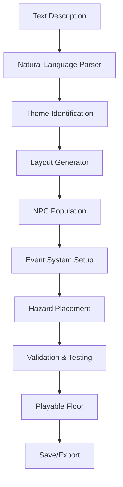

# 🏢 Floor Generator Documentation

## Overview
The Floor Generator is an AI-powered system that creates playable elevator floors from natural language descriptions. This system enables rapid level design, procedural content generation, and dynamic floor experiences in the Elevator Operator game.

## Table of Contents
- [System Architecture](#system-architecture)
- [API Reference](#api-reference)
- [Floor Description Language](#floor-description-language)
- [Generation Pipeline](#generation-pipeline)
- [Floor Templates](#floor-templates)
- [NPC Population](#npc-population)
- [Event Scripting](#event-scripting)
- [Environmental Hazards](#environmental-hazards)
- [Integration Guide](#integration-guide)
- [Examples](#examples)
- [Best Practices](#best-practices)

## System Architecture

### Core Components

```
floor_generator/
├── core/
│   ├── parser.py              # Natural language parser
│   ├── floor_builder.py       # Floor construction engine
│   ├── layout_generator.py    # Spatial layout creation
│   └── theme_processor.py     # Theme application
├── templates/
│   ├── office.py              # Office floor template
│   ├── laboratory.py          # Lab floor template
│   ├── creative_space.py      # Art/music floor template
│   ├── industrial.py          # Maker space template
│   └── custom.py              # Custom floor builder
├── population/
│   ├── npc_generator.py       # NPC creation and placement
│   ├── behavior_scripts.py    # NPC behavior patterns
│   ├── dialogue_generator.py  # Dynamic dialogue creation
│   └── crowd_dynamics.py      # Crowd simulation
├── events/
│   ├── event_scheduler.py     # Time-based events
│   ├── trigger_system.py      # Event triggers
│   ├── disaster_events.py     # Disaster scenarios
│   └── special_events.py      # Unique floor events
├── hazards/
│   ├── static_hazards.py      # Fixed environmental dangers
│   ├── dynamic_hazards.py     # Moving/changing hazards
│   └── interactive_hazards.py # Player-triggered hazards
└── utils/
    ├── validator.py           # Input validation
    ├── serializer.py          # Save/load floors
    └── preview.py             # Floor preview generation
```

### Data Flow



## API Reference

### Core Functions

#### `generate_floor()`
Generate a complete floor from description.

```python
def generate_floor(
    description: str,
    floor_number: int,
    difficulty: str = "normal",
    theme_override: str = None,
    npc_density: float = 1.0,
    event_frequency: float = 1.0,
    hazard_level: int = 1,
    seed: int = None
) -> Floor:
    """
    Generate a playable floor from text description.
    
    Args:
        description: Natural language floor description
        floor_number: Floor number (1-16, basement, roof)
        difficulty: Difficulty setting ("easy", "normal", "hard", "chaos")
        theme_override: Force specific theme
        npc_density: NPC population multiplier (0.5-2.0)
        event_frequency: Event occurrence multiplier
        hazard_level: Environmental danger level (0-5)
        seed: Random seed for reproducible generation
    
    Returns:
        Floor object ready for gameplay
    
    Example:
        floor = generate_floor(
            "Chaotic biotech lab with escaped experiments and panicked scientists",
            floor_number=8,
            difficulty="hard",
            npc_density=1.5,
            hazard_level=3
        )
    """
```

#### `parse_floor_description()`
Parse natural language into floor components.

```python
def parse_floor_description(description: str) -> FloorComponents:
    """
    Parse description into structured components.
    
    Args:
        description: Natural language floor description
    
    Returns:
        FloorComponents with extracted elements:
        - theme: Primary floor theme
        - mood: Atmosphere/mood
        - npcs: List of NPC types
        - hazards: Environmental hazards
        - events: Special events
        - layout: Spatial arrangement
    
    Example:
        components = parse_floor_description(
            "Busy startup office with stressed founders, broken coffee machine, 
            and impromptu investor meeting in progress"
        )
        # Returns:
        # theme: "office"
        # mood: "stressed"
        # npcs: ["founder", "investor", "employee"]
        # hazards: ["broken_equipment"]
        # events: ["meeting"]
    """
```

#### `create_floor_layout()`
Generate spatial layout for floor.

```python
def create_floor_layout(
    theme: str,
    size: tuple = (100, 20),
    rooms: int = None,
    elevator_position: str = "center"
) -> FloorLayout:
    """
    Create floor spatial layout.
    
    Args:
        theme: Floor theme for layout style
        size: Floor dimensions (width, height)
        rooms: Number of distinct areas
        elevator_position: Elevator location
    
    Returns:
        FloorLayout with room definitions
    
    Example:
        layout = create_floor_layout(
            theme="laboratory",
            size=(120, 25),
            rooms=5,
            elevator_position="left"
        )
    """
```

## Floor Description Language

### Basic Syntax

The Floor Generator understands natural language descriptions with key elements:

```
[Mood/Atmosphere] [Theme] with [NPCs], [Hazards], and [Events]
```

### Keywords and Modifiers

#### Mood Keywords
- **Calm**: "peaceful", "quiet", "serene", "tranquil"
- **Busy**: "hectic", "crowded", "bustling", "active"
- **Tense**: "stressed", "anxious", "nervous", "pressured"
- **Chaotic**: "pandemonium", "mayhem", "disorder", "crazy"
- **Dangerous**: "hazardous", "risky", "threatening", "unsafe"

#### Theme Keywords
- **Office**: "workspace", "cubicles", "meeting rooms", "corporate"
- **Laboratory**: "lab", "research", "experiments", "scientific"
- **Creative**: "art", "music", "studio", "gallery", "performance"
- **Industrial**: "factory", "workshop", "machinery", "manufacturing"
- **Social**: "lounge", "bar", "networking", "party", "gathering"

#### NPC Descriptors
- **Quantity**: "few", "several", "many", "crowds of", "packed with"
- **Behavior**: "angry", "happy", "rushing", "waiting", "working"
- **Type**: "scientists", "artists", "workers", "visitors", "security"

### Example Descriptions

```python
descriptions = [
    # Simple description
    "Quiet library floor with studying students",
    
    # Complex description
    "Chaotic maker space with sparks flying from welding stations, 
    3D printers running overtime, and excited inventors showing off prototypes",
    
    # Event-focused
    "Venture capital floor during pitch day with nervous founders, 
    skeptical investors, and overflowing conference rooms",
    
    # Hazard-heavy
    "Dangerous biotech lab with chemical spills, escaped test subjects, 
    and malfunctioning equipment creating toxic fumes",
    
    # Mood-driven
    "Eerily quiet office floor at 3am with only security guards 
    and one stressed programmer still debugging"
]
```

## Generation Pipeline

### Stage 1: Parsing

```python
class FloorParser:
    """Parse natural language floor descriptions."""
    
    def __init__(self):
        self.theme_detector = ThemeDetector()
        self.npc_extractor = NPCExtractor()
        self.hazard_identifier = HazardIdentifier()
        self.event_parser = EventParser()
        
    def parse(self, description: str) -> ParsedFloor:
        """
        Parse description into components.
        
        Steps:
        1. Tokenize and tag parts of speech
        2. Extract theme keywords
        3. Identify NPC types and quantities
        4. Detect hazard indicators
        5. Find event triggers
        6. Determine mood/atmosphere
        """
        tokens = self.tokenize(description)
        
        return ParsedFloor(
            theme=self.theme_detector.detect(tokens),
            npcs=self.npc_extractor.extract(tokens),
            hazards=self.hazard_identifier.identify(tokens),
            events=self.event_parser.parse(tokens),
            mood=self.mood_analyzer.analyze(tokens)
        )
```

### Stage 2: Layout Generation

```python
class LayoutGenerator:
    """Generate floor spatial layouts."""
    
    def generate(self, parsed_floor: ParsedFloor) -> Layout:
        """
        Create floor layout based on parsed components.
        
        Steps:
        1. Select base template for theme
        2. Generate room structure
        3. Place elevator access
        4. Add navigation paths
        5. Define zones (safe, hazard, event)
        """
        template = self.get_template(parsed_floor.theme)
        rooms = self.generate_rooms(template, parsed_floor.complexity)
        
        layout = Layout()
        layout.add_rooms(rooms)
        layout.add_elevator(position="center")
        layout.add_paths(self.pathfind(rooms))
        layout.define_zones(parsed_floor.hazards)
        
        return layout
```

### Stage 3: Population

```python
class FloorPopulator:
    """Populate floors with NPCs."""
    
    def populate(
        self,
        layout: Layout,
        npc_types: List[str],
        density: float = 1.0
    ) -> List[NPC]:
        """
        Add NPCs to floor.
        
        Steps:
        1. Calculate NPC count based on density
        2. Generate NPC sprites and behaviors
        3. Place NPCs in appropriate zones
        4. Set up movement patterns
        5. Create interaction triggers
        """
        npc_count = self.calculate_count(layout.size, density)
        npcs = []
        
        for i in range(npc_count):
            npc_type = random.choice(npc_types)
            npc = self.create_npc(npc_type)
            position = self.find_spawn_position(layout, npc_type)
            npc.place_at(position)
            npc.set_behavior(self.get_behavior(npc_type))
            npcs.append(npc)
            
        return npcs
```

## Floor Templates

### Office Template

```python
class OfficeFloorTemplate:
    """Template for office-themed floors."""
    
    def __init__(self):
        self.room_types = [
            "cubicle_area",
            "conference_room",
            "break_room",
            "reception",
            "executive_office"
        ]
        
        self.npc_types = [
            "office_worker",
            "manager",
            "receptionist",
            "janitor",
            "visitor"
        ]
        
        self.common_hazards = [
            "spilled_coffee",
            "loose_cables",
            "broken_printer"
        ]
        
        self.events = [
            "meeting_in_progress",
            "fire_drill",
            "birthday_party",
            "deadline_crunch"
        ]
        
    def generate_layout(self, size: tuple) -> Layout:
        """Generate office layout."""
        layout = Layout(size)
        
        # Add cubicle farm
        layout.add_room(
            Room("cubicles", 
                 size=(size[0] * 0.4, size[1] * 0.6),
                 position=(10, 5))
        )
        
        # Add conference rooms
        for i in range(2):
            layout.add_room(
                Room(f"conference_{i}",
                     size=(15, 10),
                     position=(size[0] - 20, i * 12))
            )
            
        return layout
```

### Laboratory Template

```python
class LaboratoryFloorTemplate:
    """Template for laboratory-themed floors."""
    
    def __init__(self):
        self.room_types = [
            "main_lab",
            "clean_room",
            "storage",
            "observation_room",
            "decontamination"
        ]
        
        self.npc_types = [
            "scientist",
            "lab_assistant",
            "test_subject",
            "security_guard",
            "visitor_with_badge"
        ]
        
        self.common_hazards = [
            "chemical_spill",
            "biohazard",
            "radiation_zone",
            "broken_equipment",
            "escaped_specimen"
        ]
        
        self.events = [
            "experiment_in_progress",
            "contamination_alert",
            "inspection",
            "breakthrough_discovery"
        ]
        
    def generate_layout(self, size: tuple) -> Layout:
        """Generate laboratory layout."""
        layout = Layout(size)
        
        # Add main lab space
        layout.add_room(
            Room("main_lab",
                 size=(size[0] * 0.5, size[1] * 0.7),
                 position=(size[0] * 0.25, 5),
                 properties={"requires_badge": True})
        )
        
        # Add decontamination chamber at entrance
        layout.add_room(
            Room("decontamination",
                 size=(10, 8),
                 position=(0, size[1] // 2 - 4),
                 properties={"mandatory_passage": True})
        )
        
        return layout
```

### Creative Space Template

```python
class CreativeSpaceTemplate:
    """Template for art/music floors."""
    
    def __init__(self):
        self.room_types = [
            "gallery",
            "studio",
            "performance_space",
            "workshop",
            "lounge"
        ]
        
        self.npc_types = [
            "artist",
            "musician",
            "curator",
            "art_student",
            "critic",
            "patron"
        ]
        
        self.common_hazards = [
            "wet_paint",
            "sculpture_pieces",
            "loud_music",
            "stage_equipment"
        ]
        
        self.events = [
            "art_opening",
            "live_performance",
            "workshop_in_session",
            "impromptu_jam"
        ]
```

## NPC Population

### NPC Generation

```python
class NPCGenerator:
    """Generate NPCs for floors."""
    
    def generate_npc(
        self,
        npc_type: str,
        floor_theme: str,
        mood: str = "neutral"
    ) -> NPC:
        """
        Generate NPC with appropriate attributes.
        
        Args:
            npc_type: Type of NPC to generate
            floor_theme: Floor context
            mood: Current floor mood
        
        Returns:
            Configured NPC object
        """
        # Generate sprite
        sprite = generate_sprite(
            self.get_description(npc_type, mood),
            style="16bit"
        )
        
        # Create NPC
        npc = NPC(
            type=npc_type,
            sprite=sprite,
            behavior=self.get_behavior(npc_type, mood),
            dialogue=self.generate_dialogue(npc_type, floor_theme),
            patience=self.calculate_patience(npc_type, mood),
            destination_floor=self.assign_destination(npc_type)
        )
        
        return npc
```

### Behavior Patterns

```python
class NPCBehavior:
    """Define NPC behavior patterns."""
    
    BEHAVIOR_PATTERNS = {
        "office_worker": {
            "normal": ["working", "walking", "waiting"],
            "stressed": ["rushing", "complaining", "impatient"],
            "relaxed": ["chatting", "slow_walking", "patient"]
        },
        "scientist": {
            "normal": ["observing", "note_taking", "careful_walking"],
            "excited": ["rushing", "gesturing", "talking_fast"],
            "worried": ["checking_equipment", "nervous", "cautious"]
        },
        "artist": {
            "normal": ["creating", "contemplating", "wandering"],
            "inspired": ["energetic", "talkative", "spontaneous"],
            "frustrated": ["pacing", "sighing", "distracted"]
        }
    }
    
    def get_behavior(self, npc_type: str, mood: str) -> List[str]:
        """Get behavior list for NPC."""
        patterns = self.BEHAVIOR_PATTERNS.get(npc_type, {})
        return patterns.get(mood, patterns.get("normal", ["idle"]))
```

### Dialogue Generation

```python
class DialogueGenerator:
    """Generate contextual NPC dialogue."""
    
    def generate(
        self,
        npc_type: str,
        context: dict,
        mood: str = "neutral"
    ) -> List[str]:
        """
        Generate dialogue lines for NPC.
        
        Args:
            npc_type: Type of NPC
            context: Current context (floor, time, events)
            mood: NPC mood state
        
        Returns:
            List of possible dialogue lines
        """
        base_dialogue = self.get_base_dialogue(npc_type)
        contextual = self.add_context(base_dialogue, context)
        mood_adjusted = self.adjust_for_mood(contextual, mood)
        
        return mood_adjusted
    
    def get_base_dialogue(self, npc_type: str) -> List[str]:
        """Get base dialogue for NPC type."""
        dialogue_db = {
            "office_worker": [
                "Another day, another dollar.",
                "Is it Friday yet?",
                "The printer's broken again.",
                "I need more coffee."
            ],
            "scientist": [
                "The results are fascinating!",
                "We need more data.",
                "Safety protocols, please.",
                "This could change everything."
            ],
            "artist": [
                "It's all about expression.",
                "I'm inspired by the chaos.",
                "Art is life, life is art.",
                "Do you see what I see?"
            ]
        }
        return dialogue_db.get(npc_type, ["..."])
```

## Event Scripting

### Event System

```python
class FloorEventSystem:
    """Manage floor-specific events."""
    
    def __init__(self, floor: Floor):
        self.floor = floor
        self.scheduled_events = []
        self.triggered_events = []
        self.active_events = []
        
    def schedule_event(
        self,
        event_type: str,
        trigger_time: float,
        duration: float = None,
        conditions: dict = None
    ):
        """
        Schedule a floor event.
        
        Args:
            event_type: Type of event
            trigger_time: When to trigger (seconds)
            duration: Event duration
            conditions: Required conditions
        """
        event = FloorEvent(
            type=event_type,
            trigger_time=trigger_time,
            duration=duration,
            conditions=conditions
        )
        self.scheduled_events.append(event)
        
    def update(self, dt: float, game_state: dict):
        """Update event system."""
        # Check scheduled events
        for event in self.scheduled_events[:]:
            if event.should_trigger(game_state):
                self.trigger_event(event)
                self.scheduled_events.remove(event)
                
        # Update active events
        for event in self.active_events[:]:
            event.update(dt)
            if event.is_complete():
                self.end_event(event)
                self.active_events.remove(event)
```

### Event Types

```python
class FloorEvents:
    """Define floor event types."""
    
    EVENTS = {
        "meeting": {
            "duration": 300,  # 5 minutes
            "npcs_required": ["manager", "office_worker"],
            "effects": {
                "block_conference_room": True,
                "increase_hallway_traffic": 1.5
            }
        },
        "experiment": {
            "duration": 180,
            "npcs_required": ["scientist"],
            "effects": {
                "hazard_chance": 0.3,
                "npc_distracted": True
            }
        },
        "performance": {
            "duration": 240,
            "npcs_required": ["artist", "musician"],
            "effects": {
                "attract_crowd": True,
                "noise_level": "high"
            }
        },
        "fire_drill": {
            "duration": 120,
            "npcs_required": [],
            "effects": {
                "force_evacuation": True,
                "elevator_priority": "emergency"
            }
        }
    }
```

### Custom Events

```python
def create_custom_event(
    name: str,
    description: str,
    trigger_condition: str,
    effects: dict
) -> FloorEvent:
    """
    Create custom floor event.
    
    Args:
        name: Event identifier
        description: Event description
        trigger_condition: When to trigger
        effects: Event effects
    
    Example:
        crypto_crash = create_custom_event(
            name="crypto_crash",
            description="Crypto market crashes, Floor 12 in chaos",
            trigger_condition="random_chance(0.1) and floor==12",
            effects={
                "npc_mood": "panic",
                "spawn_extra_npcs": 20,
                "dialogue_override": ["It's all gone!", "HODL!", "Buy the dip!"]
            }
        )
    """
```

## Environmental Hazards

### Static Hazards

```python
class StaticHazard:
    """Non-moving environmental hazards."""
    
    HAZARD_TYPES = {
        "spill": {
            "damage": 5,
            "effect": "slip",
            "visual": "puddle",
            "avoidable": True
        },
        "broken_glass": {
            "damage": 10,
            "effect": "cut",
            "visual": "shards",
            "avoidable": True
        },
        "exposed_wire": {
            "damage": 20,
            "effect": "shock",
            "visual": "sparks",
            "avoidable": False
        },
        "radiation": {
            "damage": 15,
            "effect": "poison",
            "visual": "glow",
            "avoidable": False,
            "requires": "hazmat_suit"
        }
    }
    
    def __init__(self, hazard_type: str, position: tuple):
        self.type = hazard_type
        self.properties = self.HAZARD_TYPES[hazard_type]
        self.position = position
        self.active = True
```

### Dynamic Hazards

```python
class DynamicHazard:
    """Moving or changing hazards."""
    
    def __init__(self, hazard_type: str, path: List[tuple]):
        self.type = hazard_type
        self.path = path
        self.current_position = 0
        self.speed = self.get_speed(hazard_type)
        
    def update(self, dt: float):
        """Update hazard position."""
        self.current_position += self.speed * dt
        if self.current_position >= len(self.path):
            self.current_position = 0  # Loop
            
    def get_position(self) -> tuple:
        """Get current hazard position."""
        index = int(self.current_position)
        return self.path[index % len(self.path)]
```

### Hazard Placement

```python
class HazardPlacer:
    """Place hazards on floors."""
    
    def place_hazards(
        self,
        floor: Floor,
        hazard_level: int,
        theme: str
    ) -> List[Hazard]:
        """
        Place appropriate hazards on floor.
        
        Args:
            floor: Floor to add hazards to
            hazard_level: Danger level (0-5)
            theme: Floor theme for hazard selection
        """
        hazards = []
        hazard_count = self.calculate_count(hazard_level, floor.size)
        hazard_types = self.get_theme_hazards(theme)
        
        for i in range(hazard_count):
            hazard_type = random.choice(hazard_types)
            position = self.find_valid_position(floor)
            
            if self.is_dynamic_hazard(hazard_type):
                path = self.generate_path(floor, position)
                hazard = DynamicHazard(hazard_type, path)
            else:
                hazard = StaticHazard(hazard_type, position)
                
            hazards.append(hazard)
            
        return hazards
```

## Integration Guide

### Game Integration

```python
class FloorManager:
    """Manage generated floors in game."""
    
    def __init__(self):
        self.floors = {}
        self.current_floor = None
        self.generator = FloorGenerator()
        
    def load_floor(self, floor_number: int, description: str = None):
        """Load or generate floor."""
        if floor_number not in self.floors:
            if description:
                # Generate from description
                floor = self.generator.generate_floor(
                    description=description,
                    floor_number=floor_number
                )
            else:
                # Use default for floor number
                floor = self.load_default_floor(floor_number)
                
            self.floors[floor_number] = floor
            
        self.current_floor = self.floors[floor_number]
        return self.current_floor
        
    def update_floor(self, dt: float, game_state: dict):
        """Update current floor."""
        if self.current_floor:
            self.current_floor.update(dt, game_state)
            self.check_events()
            self.update_hazards(dt)
            self.update_npcs(dt)
```

### Save/Load System

```python
class FloorSerializer:
    """Save and load generated floors."""
    
    def save_floor(self, floor: Floor, filename: str):
        """Save floor to file."""
        data = {
            "description": floor.description,
            "layout": self.serialize_layout(floor.layout),
            "npcs": self.serialize_npcs(floor.npcs),
            "hazards": self.serialize_hazards(floor.hazards),
            "events": self.serialize_events(floor.events),
            "metadata": {
                "floor_number": floor.number,
                "theme": floor.theme,
                "difficulty": floor.difficulty,
                "created": datetime.now().isoformat()
            }
        }
        
        with open(filename, 'w') as f:
            json.dump(data, f, indent=2)
            
    def load_floor(self, filename: str) -> Floor:
        """Load floor from file."""
        with open(filename, 'r') as f:
            data = json.load(f)
            
        floor = Floor()
        floor.description = data["description"]
        floor.layout = self.deserialize_layout(data["layout"])
        floor.npcs = self.deserialize_npcs(data["npcs"])
        floor.hazards = self.deserialize_hazards(data["hazards"])
        floor.events = self.deserialize_events(data["events"])
        floor.metadata = data["metadata"]
        
        return floor
```

## Examples

### Complete Floor Generation

```python
# Generate a complex floor with all features
description = """
Chaotic biotech laboratory on Floor 8 during a contamination alert.
Scientists in hazmat suits rushing around, broken equipment sparking,
chemical spills creating toxic puddles, and escaped test subjects
hiding in the ventilation. Emergency lights flashing, alarms blaring,
and the head scientist trying to contain the situation while arguing
with security about evacuation protocols.
"""

floor = generate_floor(
    description=description,
    floor_number=8,
    difficulty="hard",
    npc_density=1.5,
    event_frequency=2.0,
    hazard_level=4
)

# Floor will include:
# - Laboratory layout with multiple rooms
# - 15-20 NPCs (scientists, security, test subjects)
# - Chemical spills, sparking equipment hazards
# - Contamination event in progress
# - Emergency lighting effects
# - Evacuation route indicators
```

### Simple Floor Generation

```python
# Generate a simple, calm floor
description = "Quiet library floor with students studying"

floor = generate_floor(
    description=description,
    floor_number=15,
    difficulty="easy",
    npc_density=0.5,
    hazard_level=0
)

# Floor will include:
# - Library layout with reading areas
# - 5-8 quiet NPCs (students, librarian)
# - No hazards
# - Peaceful atmosphere
```

### Custom Theme Floor

```python
# Create a floor with custom theme
custom_theme = {
    "name": "abandoned",
    "layout_style": "deteriorated",
    "npc_types": ["ghost", "security_guard", "urban_explorer"],
    "hazards": ["broken_floor", "falling_debris", "darkness"],
    "mood": "eerie",
    "lighting": "minimal"
}

floor = generate_floor(
    description="Abandoned floor with mysterious sounds and shadows",
    floor_number=13,  # Unlucky floor
    theme_override=custom_theme,
    hazard_level=3
)
```

### Event-Driven Floor

```python
# Generate floor with specific event sequence
floor = generate_floor(
    description="VC floor during Demo Day with pitched startups",
    floor_number=10
)

# Add custom event sequence
floor.add_event_sequence([
    {
        "time": 0,
        "event": "announcement",
        "message": "Demo Day begins!"
    },
    {
        "time": 30,
        "event": "crowd_rush",
        "npcs": 50,
        "destination": "conference_room_1"
    },
    {
        "time": 120,
        "event": "vip_arrival",
        "vip": "Famous Angel Investor",
        "security_level": "high"
    },
    {
        "time": 300,
        "event": "pitch_winner",
        "celebration": True,
        "confetti": True
    }
])
```

## Best Practices

### Description Writing

```python
# Good descriptions - specific and atmospheric
good_descriptions = [
    "Frantic trading floor with shouting brokers, multiple screens showing red numbers, papers flying everywhere, and the smell of burnt coffee",
    
    "Serene meditation space with soft lighting, cushions arranged in circles, gentle incense burning, and a guru leading breathing exercises",
    
    "Maker space workshop with 3D printers humming, laser cutter in operation, sawdust in the air, and inventors excitedly comparing prototypes"
]

# Poor descriptions - too vague
poor_descriptions = [
    "Office floor",
    "Some people working",
    "Normal floor with stuff"
]
```

### Performance Optimization

```python
class FloorCache:
    """Cache generated floors for reuse."""
    
    def __init__(self, max_size: int = 20):
        self.cache = {}
        self.max_size = max_size
        
    def get_or_generate(
        self,
        description: str,
        floor_number: int
    ) -> Floor:
        """Get